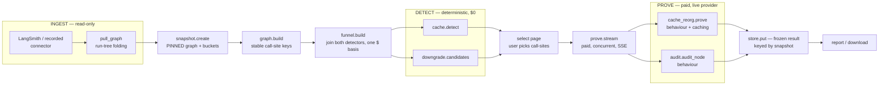
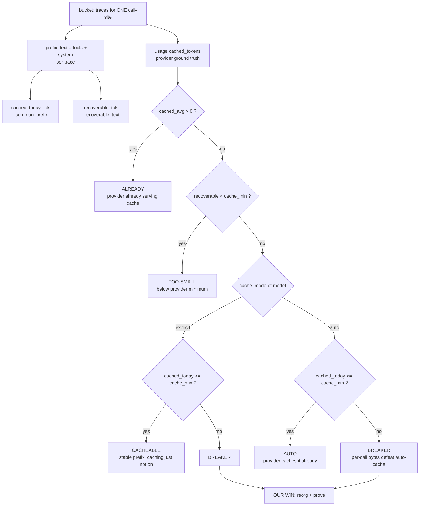
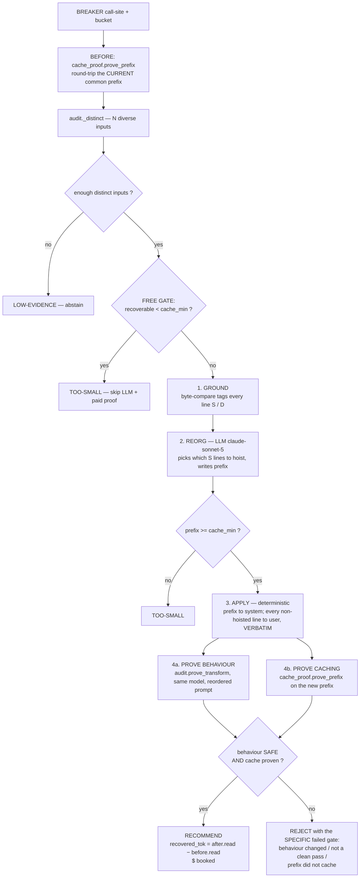
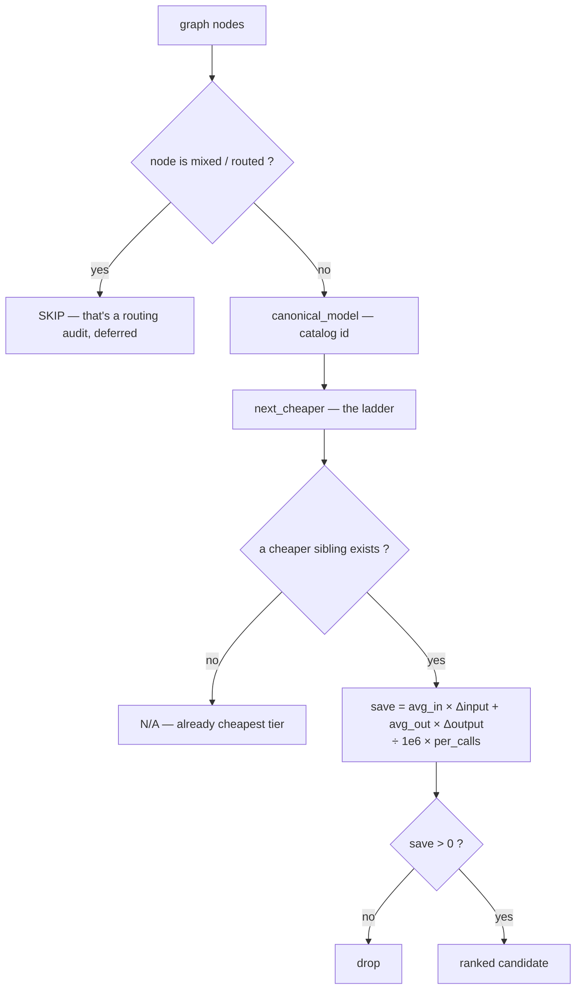
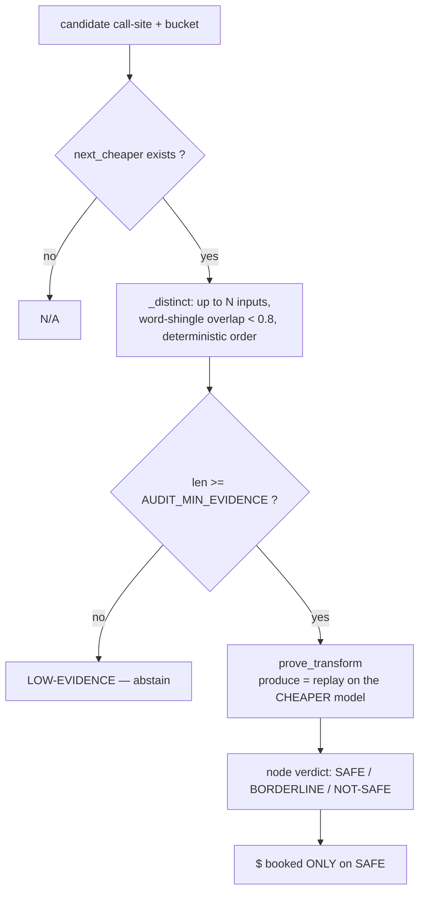
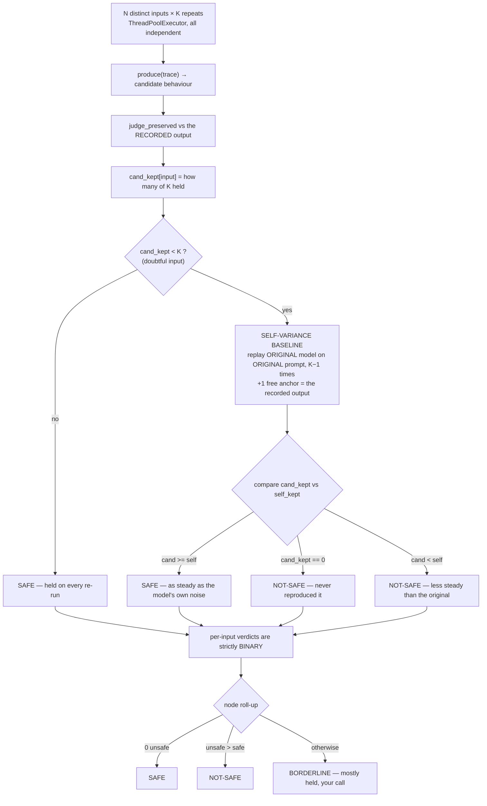
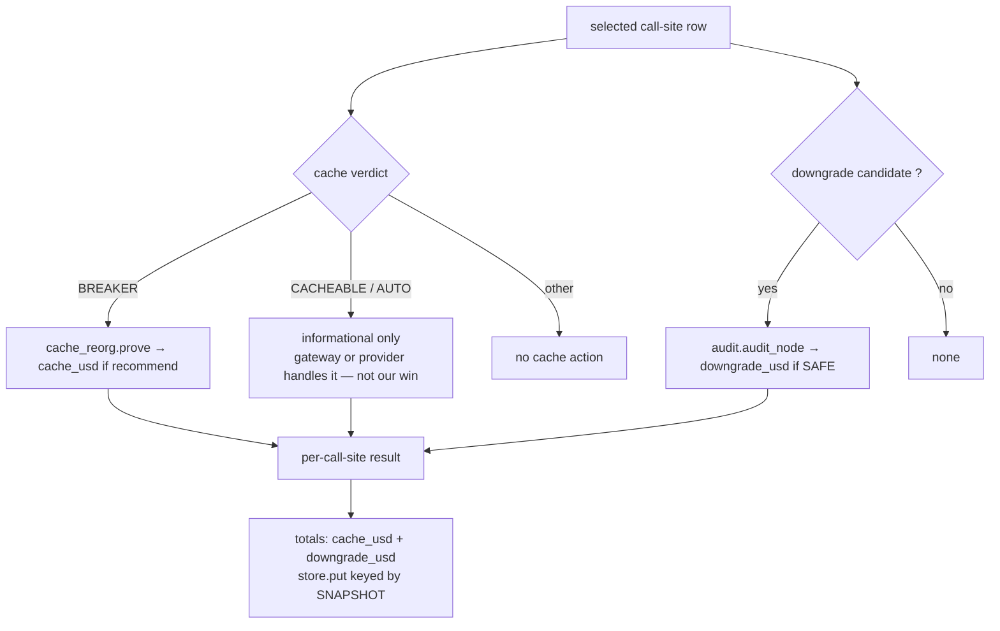

# Lever Architecture — Cache-Prefix Expansion & Model-Downgrade Tier

Source-of-truth description of the two production levers, written so diagrams can be generated
(and regenerated) from it. Every claim below is taken from the code, not from a plan document.

Code map:

| Concern | File |
|---|---|
| Ingest / call-site grouping | [connectors/datasource.py](connectors/datasource.py), [connectors/graph.py](connectors/graph.py) |
| Pinned snapshot | [app/services/snapshot.py](app/services/snapshot.py), [app/services/store.py](app/services/store.py) |
| Call-site view | [app/services/graph.py](app/services/graph.py) |
| Ranked opportunities | [app/services/funnel.py](app/services/funnel.py) |
| Cache detection ($0) | [app/services/cache.py](app/services/cache.py) |
| Cache reorg + dual proof (paid) | [app/services/cache_reorg.py](app/services/cache_reorg.py) |
| Cache round-trip proof (paid) | [app/services/cache_proof.py](app/services/cache_proof.py) |
| Downgrade detection ($0) | [app/services/downgrade.py](app/services/downgrade.py) |
| Shared proof engine + judge (paid) | [app/services/audit.py](app/services/audit.py) |
| Proof orchestration / SSE | [app/services/prove.py](app/services/prove.py) |
| Model catalog (prices, tiers, cache rules) | [auditor/models.json](auditor/models.json), [auditor/util.py](auditor/util.py) |
| Provider boundary | [app/services/llm_client.py](app/services/llm_client.py) |

---

## 0. Tooling: what to draw these with

**Recommendation: Mermaid, checked into this repo, embedded in Markdown.** Not draw.io.

Reasons, in priority order:

1. **The diagram must not drift from the code.** These levers change weekly (cache policies, verdict
   rules, judge tiers). A text diagram sits three lines from the module it describes and gets edited in
   the same commit. A `.drawio` file gets edited once and rots.
2. **It diffs in review.** A Mermaid change shows as `+3 −1` in a PR. A draw.io XML change shows as an
   unreadable blob, so nobody reviews it and errors ship.
3. **It renders where the work happens** — GitHub, VS Code preview, and any Markdown→HTML doc pipeline —
   with zero export step.
4. **Cost of the alternative is real.** draw.io buys pixel-perfect layout, which matters for exactly one
   artifact (an exec slide), not for the seven diagrams engineering needs.

Practical split:

- **Engineering diagrams (all of section 2–6 below): Mermaid in-repo.** Regenerate by editing text.
- **One exec hero diagram, if a deck needs it:** export the Mermaid to SVG (`mmdc -i x.md -o x.svg`) and
  polish in Excalidraw or Figma *once*, treating it as a derived artifact. Never maintain two sources —
  if the polished slide and the Mermaid disagree, the Mermaid wins.

Use draw.io only if a non-engineer must edit the diagram directly. That is not the case here.

---

## 1. The shared spine

Both levers are detectors that hang off one pipeline. Nothing is claimed that a live call did not measure.

Three invariants the diagram must convey:

- **Detection is free and deterministic; proof is paid and live.** The split is the product's whole claim.
- **The snapshot is pinned.** `snapshot.create` fetches once; view, select, prove, re-prove and download all
  read that same graph by id. Nothing re-derives from the platform mid-flow, so call-site identity cannot
  move under the user and selected keys cannot go stale.
- **Identity is the stable key** `agent / subgraph-path / node-label`, never the display label and never the
  connector's content-variant key (which drifts with the sample).

---

## 2. Lever A — Cache-prefix expansion

### 2.1 The physics being exploited

Providers cache a **contiguous, byte-identical leading prefix**, serialized as `tools → system → messages`.
One differing byte — a timestamp, an injected RAG chunk, a reordered tool list — kills caching from that
byte onward. Cache reads cost ~10% of fresh input.

So there are two distinct numbers per call-site:

- **cached-today** = longest byte-identical *leading* prefix across the bucket (`cache._common_prefix`).
- **recoverable** = every *line* byte-identical across the bucket (`cache._recoverable_text`) — the ceiling
  once per-call bits are moved after the prefix.

The gap between them is the lever.

### 2.2 Detection ($0) — `cache.detect`

`cache_mode` and `cache_min` come from [auditor/models.json](auditor/models.json) — the single source of
truth. `explicit` (Anthropic) means nothing caches without a `cache_control` breakpoint, so "enable caching"
is a real, provable fix. `auto` (OpenAI, Google) means "enable" is a no-op — but a per-call prefix that
breaks the stable region still defeats the auto-cache, so **reorg still applies**. Unknown models default to
`auto`, so we never advise a breakpoint the catalog didn't confirm.

Money: `save_per_1k = (input_price − cache_read_price) / 1e6 × save_tok × 1000`, where `save_tok` is
`cached_today` for CACHEABLE, `recoverable` for BREAKER, and `0` otherwise. Only BREAKER is booked as our
win in the funnel — CACHEABLE/AUTO is the gateway's or the provider's win, not ours.

### 2.3 Produce → prove (paid) — `cache_reorg.prove`

Four-stage division of labour. The LLM is the reorg brain and is never trusted blindly.

Guardrails that must appear in any diagram of this lever:

- **The LLM never touches dynamic content.** It returns `KEEP: <line numbers>` plus a `<PREFIX>` block; a
  hoisted line is accepted only if byte-compare independently confirms it static. Everything not hoisted is
  moved below verbatim by code, so per-call content cannot be dropped or rewritten.
- **A free hard-fact gate runs before the LLM.** If even the best-possible static is under the model's cache
  minimum, no reorg can ever cache — skip the reorg model and the paid proof entirely.
- **The proof is dual and both halves are vetoes.** A semantic break (e.g. RAG-injected instructions that
  can't move) fails the behaviour half; a cache miss fails the caching half. Either one blocks the claim.
- **Rejection names the gate.** Three distinct messages, not one vague line.

### 2.4 Cache round-trip proof — `cache_proof.prove_prefix`

Exactly 2 completions, `max_tokens=1` each (cents):

1. Send prefix with `cache_control: ephemeral`, user turn `"ping"` → provider **writes** it to cache.
2. Send the same prefix, user turn `"pong"` → provider **reads** it back.

`proven = read > 0`. The counter is read from **both** response shapes: Anthropic-native
(`cache_read_input_tokens`) and litellm-normalized OpenAI-style (`usage.prompt_tokens_details.cached_tokens`),
so the proof holds however the request is routed. There is **no behaviour judge here** — caching provably
cannot change output, so the counters are the entire proof.

---

## 3. Lever B — Model-downgrade tier

### 3.1 Detection ($0) — `downgrade.candidates`

`next_cheaper` is the non-obvious part and deserves its own callout in a diagram:

> The target is the **most-capable callable model in the nearest lower capability tier
> (frontier → balanced → small → nano) whose price is ≤ the current model's on BOTH input AND output**,
> same provider.
>
> Why the both-axes test: **pricing is not monotonic with tier.** A newer premium "flash" can cost more per
> input token than an older "pro" (gemini-3.6-flash $1.50-in vs gemini-2.5-pro $1.25-in). Picking "most
> capable in the next tier" alone lands on a target that's *pricier* on input, and an input-heavy node then
> shows a near-zero saving. Requiring Pareto-cheaper picks the most capable model that genuinely costs less.

### 3.2 Proof (paid) — `audit.audit_node`

`replay` re-runs the recorded request on the cheaper model expressing **neutral intent only** — bind these
tools (read-only, never executed), reproduce this `tool_choice`, use reasoning if the node did. Output budget
scales to the recorded output (`recorded × 1.5 + 128`, floor 512) capped at the model's real `max_output`,
so a long production output is never truncated. `llm_client.run` owns the provider request shape and is the
one boundary to swap for a litellm gateway.

The **reference is the recorded output already in the trace** — real production behaviour, never re-run.

---

## 4. The shared proof engine — `audit.prove_transform`

The architecturally important fact: **both levers are the same experiment with a different `produce`.**

| Lever | `produce(trace)` | What varies |
|---|---|---|
| Downgrade | `replay(trace, cheaper_model)` | the model |
| Cache reorg | `replay(apply(trace, prefix, static), same_model)` | the prompt order |

The self-variance baseline is lever-agnostic: always the original model on the original prompt.

Design commitments a diagram must not lose:

- **Two axes, not one.** DIVERSITY (N distinct real inputs) proves breadth; STABILITY (K repeats) proves the
  result isn't a coin flip. One run of a stochastic model plus a stochastic judge is a sample, not a fact.
- **The noise floor is measured, not assumed.** A cheaper model scoring 2/3 is only bad if the *original*
  scores 3/3. If the original is itself noisy at 1/3, the cheaper is steadier and that's SAFE. The baseline
  runs **only on doubtful inputs**, so the common case costs nothing extra.
- **Never a false SAFE.** Ties break toward not recommending; an unverifiable anchor is BORDERLINE; an
  unparseable judge reply is DRIFT; an output too long to fully verify is DRIFT.
- **$ is booked only on SAFE.** BORDERLINE earns nothing.

### 4.1 The judge — one generic judge for every payload

`judge_preserved` (model: `claude-sonnet-5`) renders text *and* tool calls into one string
(`[calls name({args})]`), so there is no structured-vs-prose branch — a tool call is just behaviour.

It asks one question: **did the candidate preserve the reference's decision and every material fact?**
Same decision/classification/tool call; every material fact, number, id, name, tool argument present and
unchanged; nothing contradicting; nothing material *added* unsupported. Explicitly **not** style, wording,
length, or which reads better.

Mechanics that exist for a reason:
- Reason first (≤15 words), verdict on the **final** line; we read the **last** `PRESERVED|DRIFT` token, so a
  "Verdict: PRESERVED" preamble still parses.
- No verdict token → DRIFT. Output over `AUDIT_JUDGE_MAX_CHARS` (120k) → DRIFT, stated honestly as
  "too long to fully verify."

---

## 5. Where the two levers meet — `prove._prove_one`

One call-site can carry both levers; they are proved in the same worker.

Call-sites are proved **concurrently** (pool of 4); each yields SSE progress. A failing call-site is caught,
surfaced with a traceback, and recorded as a $0 error row — one failure never kills the run. A stale
selection (no key matches) refuses to store an all-zero proof, so the hero number can't silently reset to $0.

---

## 6. Numbers a diagram should carry

**Config** ([app/config.py](app/config.py)): `AUDIT_SAMPLES` N=5 · `AUDIT_REPEATS` K=3 ·
`AUDIT_MIN_EVIDENCE`=3 · `AUDIT_MAX_PARALLEL`=8 · `AUDIT_SAFE_RATIO`=0.66 (fallback when K=1) ·
`AUDIT_JUDGE_MAX_CHARS`=120000 · `CALLS_BASIS`=10000.

**Paid-call budget per proved call-site:**

| Lever | Calls |
|---|---|
| Downgrade | N×K replays + N×K judges = **30**, plus up to `doubtful × (K−1) × 2` baseline calls |
| Cache reorg | 1 reorg-plan + 2 before round-trip + N×K replays + N×K judges + 2 after round-trip = **35**, plus baseline |

Detection for the whole agent: **0 calls, $0.**

---

## 7. Diagram inventory to produce

| # | Diagram | Audience | Source section |
|---|---|---|---|
| 1 | System spine — ingest → snapshot → detect → select → prove → report | both | §1 |
| 2 | Cache detection decision tree (verdict derivation) | dev | §2.2 |
| 3 | Cache produce→prove, 4 stages + dual veto | dev | §2.3 |
| 4 | Cache round-trip write/read sequence | dev | §2.4 |
| 5 | Downgrade candidate selection + the `next_cheaper` Pareto rule | dev | §3.1 |
| 6 | Shared proof engine — N×K, self-variance baseline, verdict roll-up | dev (the crown jewel) | §4 |
| 7 | Exec one-pager — detected → proven → rejected, with $ and "we never claim what we didn't measure" | exec | §1 + §5 |

Diagrams 1–6 stay Mermaid in this file. Diagram 7 is the only candidate for a hand-polished export.
